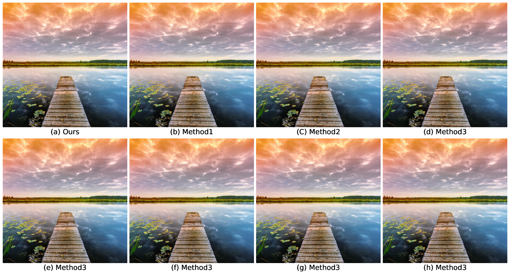
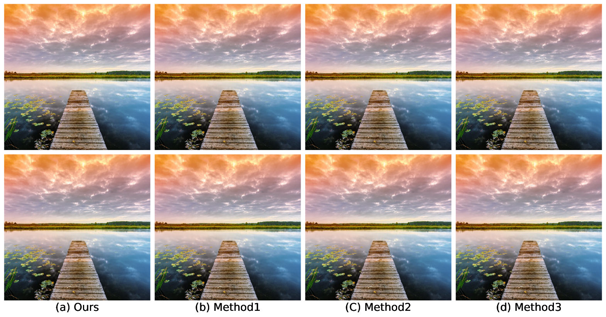
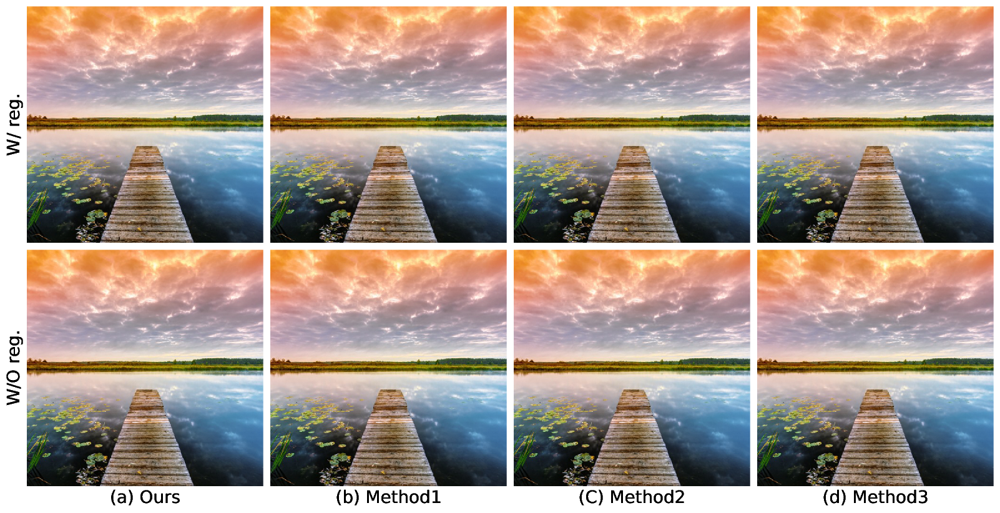

## AutoFig

Automatic figure generator such as image grids.

### Examples

#### Single row example
```sh
python main.py --config configs/config1x4.yaml 
```
<figure>

</figure>


#### Multiple rows example 
```sh
python main.py --config configs/config2x4.yaml 
```
<figure>

</figure>

#### Multiple rows example with single row label
```sh
python main.py --config configs/config2x4_single.yaml 
```

<figure>

</figure>

#### Multiple rows example with single row label and ylabel
```sh
python main.py --config configs/config2x4_ylab.yaml 
```

<figure>

</figure>
